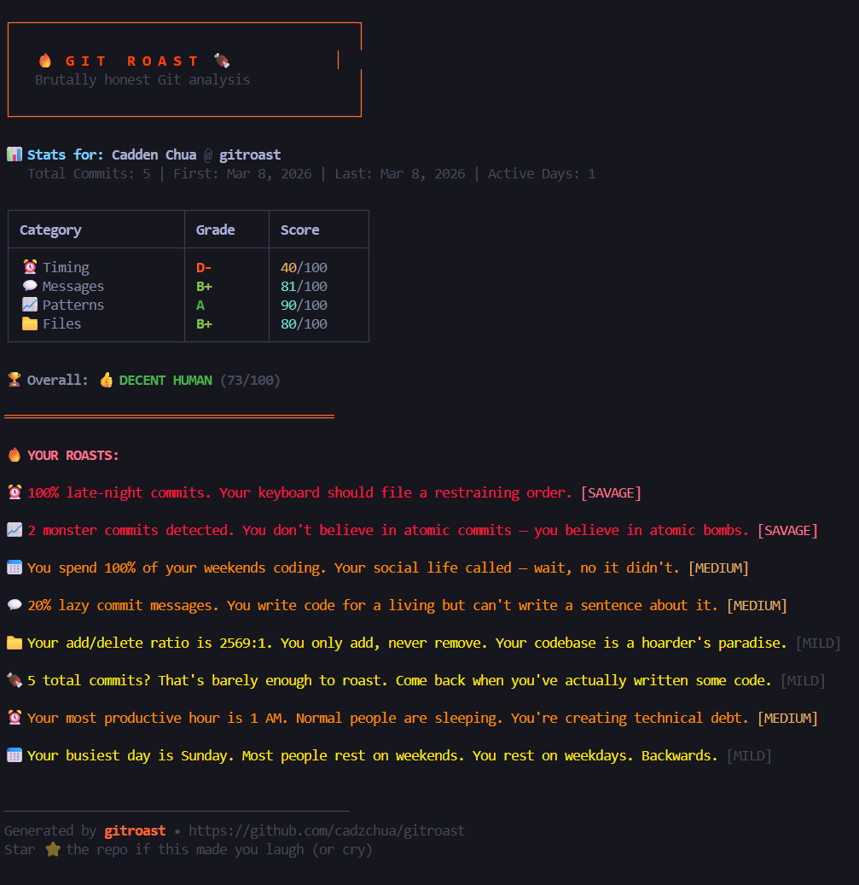

<div align="center">

# Git Roast

**Brutally honest analysis of your Git habits.**

Your commits tell a story. Git Roast makes sure it's a comedy.

[](https://www.npmjs.com/package/gitroast)
[](https://github.com/cadzchua/gitroast/actions)
[](https://opensource.org/licenses/MIT)
[](https://nodejs.org)

<br/>



</div>

## What is this?

Git Roast scans your **entire repository** — every branch, every author, every commit — and roasts you for your habits. It looks at:

- **When** you commit — 3 AM pushes don't go unnoticed
- **What** you write in commit messages — or the lack thereof
- **How** consistently you commit — streaks, droughts, the works
- **What** you change — 100 files in one commit? bold move

You get a letter-graded score across four categories and a set of personalized roasts. Outputs can be consumed as plain terminal text, JSON (for scripting), or Markdown (for sharing).

## Quick start

### Run without installing

```bash
npx gitroast
```

### Or install globally

```bash
npm install -g gitroast
gitroast
```

### Or run from source

```bash
git clone https://github.com/cadzchua/gitroast.git
cd gitroast
npm install
npm run build
npm link
gitroast
```

## Usage

```bash
# Default: analyze everything
gitroast

# Filter by author (multi-author: comma-separated)
gitroast --author "Alice"
gitroast --author "Alice,Bob"

# Filter by branch and time range
gitroast --branch main --since "6 months ago"

# Run it against a different repo
gitroast --path ../some-other-repo

# Only keep the top 3 roasts
gitroast --top 3

# Output machine-readable JSON
gitroast --format json

# Export to Markdown
gitroast --format markdown --output roast.md

# Use AI-generated roasts (requires GITROAST_API_KEY)
gitroast --ai

# Disable colors
gitroast --no-color
```

### Team mode

See who on your team has the worst Git hygiene:

```bash
gitroast --team
```

Produces a leaderboard of every author in the repo, ranked by overall score.

### Compare mode

Pit two developers head-to-head:

```bash
gitroast --compare "Alice,Bob"
```

## CLI options

| Flag                    | Description                                                | Default     |
| ----------------------- | ---------------------------------------------------------- | ----------- |
| `-a, --author <names>`  | Filter by author (comma-separated for multiple)            | all authors |
| `-b, --branch <name>`   | Only analyze a specific branch                             | all         |
| `-s, --since <date>`    | Only include commits after this date                       | all time    |
| `-p, --path <dir>`      | Path to a Git repository                                   | `.`         |
| `-t, --top <n>`         | Max number of roasts to show                               | `8`         |
| `-f, --format <type>`   | Output format: `terminal`, `json`, `markdown`              | `terminal`  |
| `-o, --output <file>`   | Write output to a file instead of stdout                   | stdout      |
| `--ai`                  | Use an LLM to generate roasts (requires `GITROAST_API_KEY`) | off         |
| `--team`                | Build a leaderboard across all authors                     | off         |
| `--compare <a,b>`       | Compare two authors head-to-head                           | off         |
| `--no-color`            | Disable colored output                                     | colors on   |
| `-V, --version`         | Show version number                                        |             |
| `-h, --help`            | Show help                                                  |             |

## Configuration file

Override any threshold with a `.gitroastrc` or `.gitroastrc.json` in the repo root (or your home directory). Unknown keys are ignored; missing keys fall back to defaults.

```json
{
  "lateNightStartHour": 21,
  "lateNightEndHour": 6,
  "bigDumpFileThreshold": 30,
  "maxRoasts": 5,
  "extraLazyPatterns": [
    { "pattern": "^ugh$", "label": "ugh" },
    { "pattern": "^f+$", "label": "fffff" }
  ]
}
```

Full list of tunable keys lives in [src/config.ts](src/config.ts).

## Scoring

Each commit is graded across four dimensions. Lower score = worse habits = harder roast.

| Level            | Score  | Description                                         |
| ---------------- | ------ | --------------------------------------------------- |
| Golden Developer | 80–100 | You're suspiciously good. Are you even human?       |
| Decent Human     | 60–79  | Normal dev. Some bad habits, but who doesn't?       |
| Chaotic Neutral  | 40–59  | You commit crimes against Git. Sometimes literally. |
| Code Gremlin     | 20–39  | Your Git history is a crime scene.                  |
| Absolute Menace  | 0–19   | You should be banned from version control.          |

## AI-powered roasts

The template-based roasts are fun, but you can plug in any OpenAI-compatible LLM for more creative output.

Create a `.env` file in the working directory:

```bash
GITROAST_API_KEY=sk-your-api-key-here
GITROAST_MODEL=gpt-4o-mini                    # optional
GITROAST_API_BASE=https://api.openai.com/v1   # optional
```

Then:

```bash
gitroast --ai
```

### Compatible providers

| Provider    | Base URL                              | Example model                 |
| ----------- | ------------------------------------- | ----------------------------- |
| OpenAI      | `https://api.openai.com/v1` (default) | `gpt-4o-mini`                 |
| Groq        | `https://api.groq.com/openai/v1`      | `llama-3.3-70b-versatile`     |
| Ollama      | `http://localhost:11434/v1`           | `llama3`                      |
| Together AI | `https://api.together.xyz/v1`         | `meta-llama/Meta-Llama-3-70B` |

If the API call fails, gitroast falls back to built-in templates automatically.

## Output formats

**Terminal** (default): Pretty, colored, boxed output for reading in a shell.

**JSON**: Full roast result including stats, per-category scores, and roast text. Easy to pipe into `jq` or dashboards.

```bash
gitroast --format json | jq '.score.overall'
```

**Markdown**: Self-contained `.md` document with a summary table and roast list, suitable for Slack/GitHub/Notion.

```bash
gitroast --format markdown --output roast.md
```

## Development

```bash
# Install deps
npm install

# Run tests
npm test                 # one-shot
npm run test:watch       # watch mode
npm run test:coverage    # with coverage

# Type check without building
npm run typecheck

# Lint and format
npm run lint
npm run format

# Build to dist/
npm run build

# Run in dev mode (uses ts-node, no build needed)
npm run dev
```

## Architecture

```
src/
├── index.ts              # CLI entrypoint (commander)
├── config.ts             # Tunable thresholds + .gitroastrc loader
├── errors.ts             # Typed error hierarchy
├── types/                # Shared TypeScript interfaces
├── utils/git.ts          # simple-git wrapper
├── analyzers/            # Pure functions that turn commits into stats
│   ├── timing.ts
│   ├── messages.ts
│   ├── patterns.ts
│   └── files.ts
├── roaster/              # Turn stats into roasts
│   ├── scoring.ts
│   ├── templates.ts
│   ├── llm.ts
│   └── index.ts
├── display/              # Output renderers
│   ├── terminal.ts
│   ├── json.ts
│   └── markdown.ts
└── modes/                # Extra CLI modes
    ├── team.ts
    └── compare.ts
```

All analyzers are pure functions with full test coverage. Swap the renderer, tune the scoring, add a template — everything is decoupled.

## Contributing

Contributions welcome — new roast templates, bug fixes, features, whatever. Please run `npm run lint && npm test` before opening a PR.

1. Fork the repo
2. Create a feature branch (`git checkout -b feature/savage-roasts`)
3. Make your changes + add tests
4. Run `npm test && npm run lint`
5. Open a PR

## License

MIT © [cadzchua](https://github.com/cadzchua)

---

<div align="center">

**If this made you laugh (or cry), leave a star.**

[Report Bug](https://github.com/cadzchua/gitroast/issues) · [Request Feature](https://github.com/cadzchua/gitroast/issues)

</div>
